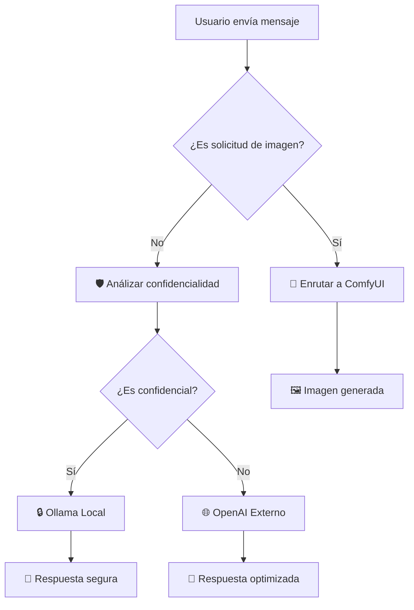

# 🛡️🎨 Integración Security Gateway + ComfyUI

## 📋 Descripción

Esta integración combina el **Security Gateway Pipeline** con el **ComfyUI Image Generator Pipeline** para crear un sistema inteligente que:

1. **Detecta automáticamente** solicitudes de generación de imágenes
2. **Enruta** las solicitudes de imagen directamente a ComfyUI
3. **Analiza la confidencialidad** de otras consultas
4. **Dirige** consultas confidenciales a Ollama local y no confidenciales a OpenAI

## 🔄 Flujo de Funcionamiento



## ⚙️ Configuración

### 1. Valves del Security Gateway

```json
{
  "COMFYUI_PIPELINE_ENABLED": true,
  "COMFYUI_BASE_URL": "http://192.168.7.101:8188",
  "OLLAMA_BASE_URL": "http://localhost:11434",
  "OLLAMA_SECURITY_MODEL": "llama3.1:8b",
  "OLLAMA_RESPONSE_MODEL": "llama3.1:70b",
  "OPENAI_API_KEY": "sk-...",
  "OPENAI_MODEL": "gpt-4"
}
```

### 2. Palabras Clave para Detección de Imágenes

El sistema detecta automáticamente estas palabras y patrones:

**Palabras clave:**
- `genera`, `crea`, `dibuja`, `imagen`, `picture`, `image`
- `draw`, `create`, `generate`, `pintura`, `dibujo`, `foto`
- `ilustra`, `diseña`, `render`, `visualiza`

**Patrones:**
- "una imagen de..."
- "una foto de..."
- "un dibujo de..."
- "una ilustración de..."
- "que se vea como..."
- "mostrar como imagen"

## 🚀 Uso

### Para Generar Imágenes

```
Usuario: "Genera una imagen de un gato gris en una cocina"
```

**Respuesta:**
```
🎨 Solicitud de imagen detectada
→ Enrutando a ComfyUI para generación

🚀 Iniciando generación de imagen...
📝 Prompt: un gato gris en una cocina
⚙️ Preparando workflow de ComfyUI...
[... proceso de generación ...]
🎉 ¡Imagen generada exitosamente!
[IMAGEN]
```

### Para Consultas Confidenciales

```
Usuario: "¿Cuáles fueron nuestras ventas del último trimestre?"
```

**Respuesta:**
```
🔒 Datos confidenciales detectados (confianza: 85%)
→ Procesando con LLM local por seguridad
→ Razón: Contiene datos financieros específicos de la empresa

[Respuesta procesada con Ollama local]
```

### Para Consultas No Confidenciales

```
Usuario: "¿Cómo puedo mejorar mis habilidades de programación?"
```

**Respuesta:**
```
🌐 Datos no confidenciales (confianza: 92%)
→ Procesando con LLM externo optimizado
→ Razón: Consulta educativa de conocimiento general

[Respuesta procesada con OpenAI]
```

## 📊 Logging y Monitoreo

### Logs de Consola

```
🎨 Solicitud de imagen detectada - enrutando a ComfyUI...
🎨 IMAGEN DETECTADA -> ComfyUI

🛡️ Analizando confidencialidad de la consulta...
🛡️ 🔒 CONFIDENCIAL (confianza: 0.85) -> Local

🛡️ 🌐 NO CONFIDENCIAL (confianza: 0.92) -> Externo
```

### Archivo de Log

Se genera automáticamente `security_decisions_[timestamp].json`:

```json
[
  {
    "timestamp": "2024-01-30T14:30:00",
    "message_hash": 1234,
    "request_type": "image_generation",
    "pipeline_used": "comfyui",
    "reasoning": "Solicitud de generación de imagen detectada automáticamente"
  },
  {
    "timestamp": "2024-01-30T14:31:00", 
    "message_hash": 5678,
    "is_confidential": true,
    "confidence": 0.85,
    "reasoning": "Contiene datos financieros específicos",
    "llm_used": "ollama_local"
  }
]
```

## 🔧 Instalación

### 1. Copiar Pipelines

```bash
# Asegurar que ambos pipelines estén en /pipelines/
cp comfyui_image_generator_pipeline.py ./pipelines/
cp security_gateway_pipeline.py ./pipelines/
```

### 2. Configurar Open WebUI

En Open WebUI, configurar el **Security Gateway** como pipeline principal:

1. Ir a **Settings** > **Pipelines**
2. Seleccionar `security_gateway_pipeline`
3. Configurar las valves según necesidades

### 3. Reiniciar Servicios

```bash
docker restart pipelines
docker restart open-webui  # si es necesario
```

## 🎯 Ventajas de la Integración

### ✅ **Automatización Inteligente**
- **Sin configuración manual**: Detecta automáticamente el tipo de solicitud
- **Routing transparente**: El usuario no necesita especificar dónde procesar

### ✅ **Seguridad Mejorada**
- **Análisis de confidencialidad**: Protege datos sensibles automáticamente
- **Logs completos**: Auditoría de todas las decisiones de enrutamiento

### ✅ **Experiencia Unificada**
- **Una sola interfaz**: Generación de imágenes + chat inteligente
- **Respuestas contextuales**: Información sobre dónde se procesó cada solicitud

### ✅ **Flexibilidad**
- **Habilitación/deshabilitación**: Control granular via valves
- **Configuración independiente**: Cada pipeline mantiene su configuración

## 🚨 Solución de Problemas

### Pipeline ComfyUI no cargado
```
⚠️ ComfyUI Pipeline no disponible - detección de imágenes deshabilitada
```
**Solución**: Verificar que `comfyui_image_generator_pipeline.py` esté en `/pipelines/`

### Error de importación
```
❌ Error cargando ComfyUI Pipeline: [error]
```
**Solución**: Verificar dependencias y configuración de ComfyUI

### Detección incorrecta
```
🎨 Solicitud de imagen detectada - enrutando a ComfyUI...
❌ Error en generación de imagen: [error]
```
**Solución**: Verificar conectividad con ComfyUI en `http://192.168.7.101:8188`

## 📝 Personalización

### Agregar más palabras clave de imagen

Editar el método `_is_image_request()` en `security_gateway_pipeline.py`:

```python
image_keywords = [
    "genera", "crea", "dibuja", "imagen", 
    # Agregar nuevas palabras aquí
    "sketch", "paint", "visualize", "render"
]
```

### Modificar criterios de confidencialidad

Editar `SECURITY_PROMPT` en las valves del Security Gateway.

### Cambiar URL de ComfyUI

Modificar `COMFYUI_BASE_URL` en las valves.

---

**🎉 ¡La integración Security Gateway + ComfyUI está lista para usar!**
